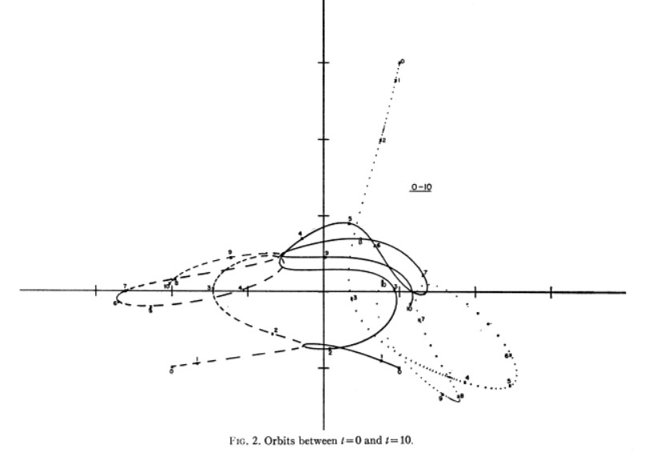
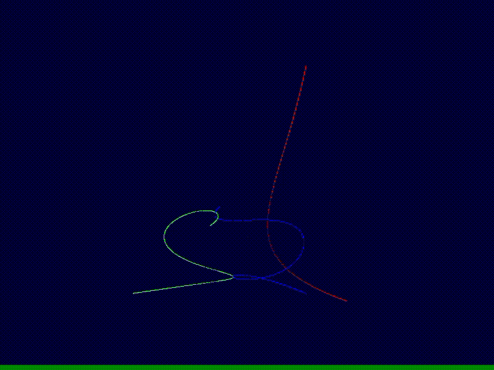

# n body simulation
This is a real-time simulation of n bodies intereactive with each other under the newton gravity.
Use Vulkan API Compute shader to run the simulation in GPU.

Three body simulation result is fitted with this paper *Complete solution of a general problem of three bodies*

